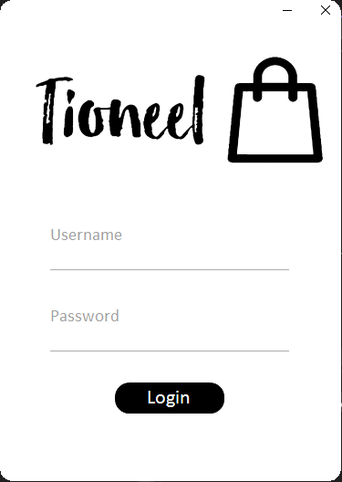
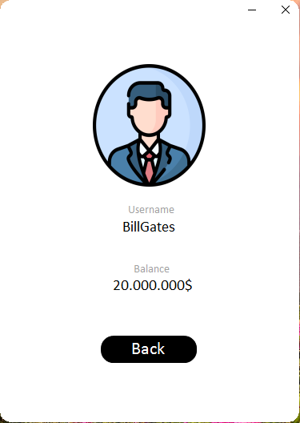
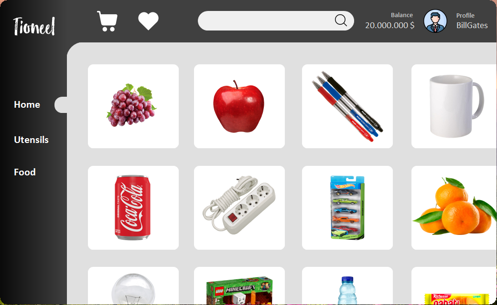
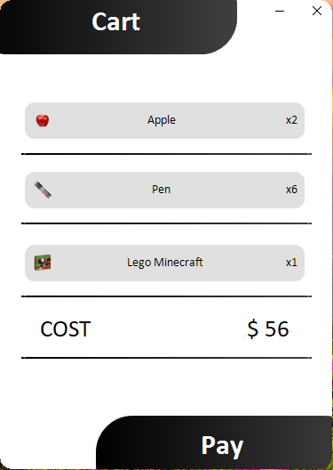

# Tioneel Market App (C# WinForms)

Nov 25, 2021 | **Tioneel** is a desktop “market app” team project made with **C# WinForms (.NET Framework)**. This project helps me practice desktop UI, multi-form navigation, and basic app flow such as login, browsing items, viewing item details, profile page, and cart.

---

## Preview (Screenshots)

| Login | Profile | Item Detail | Home | Cart |
|---|---|---|---|---|
|  |  |  |  |  |

---

## Features

- Login screen
- Home / item browsing screen
- Item detail screen
- Profile screen
- Cart screen (shopping cart flow)
- WinForms UI components with enhanced styling (Guna UI)

---

## Tech Stack

- **Language:** C#
- **Platform:** Windows Desktop
- **Framework:** WinForms
- **Target Framework:** .NET Framework 4.7.2
- **IDE:** Visual Studio (recommended)
- **UI Library:** Guna.UI (WinForms)

---

## Project Structure (High Level)

- `Tioneel.sln` - Visual Studio solution
- `Tioneel/` - Main WinForms project
  - `Form1.cs` + `Form1.Designer.cs` - Main form & UI layout
  - `Program.cs` - Entry point
  - `App.config` - App configuration
  - `Properties/` - Assembly info & resources
- `docs/` - Screenshots for README

---

## Getting Started

### Requirements
- Windows OS
- Visual Studio (2019/2022 recommended)
- .NET Framework Developer Pack **4.7.2**
- (Optional) **Guna UI** library configured (see Notes)

### Run Locally
1. Clone repository:
   ```bash
   git clone https://github.com/Aryosetowmn/desktopdev_kelas11semester1_port4.git
   ```
2. Open `Tioneel.sln` in **Visual Studio**
3. Restore/resolve references (see Notes if Guna.UI missing)
4. Build & Run (Start)

---

## Notes

- Project ini menggunakan **Guna.UI**. Jika saat dibuka muncul error reference (mis. `Guna.UI.dll` tidak ditemukan), kamu perlu:
  - install/siapkan library Guna UI di PC kamu, lalu
  - update reference path di Visual Studio supaya menunjuk ke lokasi `Guna.UI.dll` yang benar.

Repository ini dibuat untuk pembelajaran dan portfolio.

---

## Author

**Aryosetowmn**  
Repository: `Aryosetowmn/desktopdev_kelas11semester1_port4`
